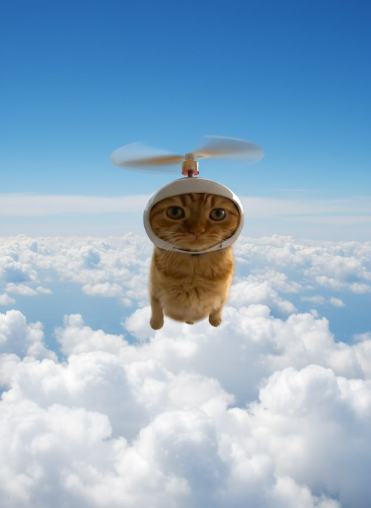

# Setup the Flying HeliCat Image

## IMPORTANT: Add the Reference Image

I've created a beautiful showcase section for the flying HeliCat image you provided!

**To complete the setup:**

1. **Save the flying HeliCat image** (the one with clouds) as: `helicat-clouds.jpg`
2. **Place it in the same folder** as index.html
3. **Refresh the page** to see the new showcase section!

The image will appear between the hero section and the about section, with a beautiful hover effect that reveals "TO THE MOON! 🚀"

## Alternative

If you have a different filename, simply update line 68 in `index.html`:

```html

```

Change `helicat-clouds.jpg` to whatever your image filename is.
